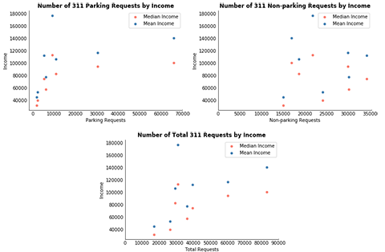

## About

---

I have always enjoyed building and tinkering, and I see web development and creating data visualizations as extensions of this. I have been able to channel my creativity into my studies, where I learned how to visualize data to present online.

While working as an undergraduate teaching assistant for my Dynamic Web Applications class, I was able to share my enthusiasm for building websites in HTML/CSS and Javascript with my fellow classmates. I secured this position from front-end development work on a website that interfaced with Prince George’s County Open Data Portal database, enabling county residents to view past litter pickups and record new ones.

Through my teaching experience, I became adept at breaking down technical concepts, such as Git, in a digestible way. My patience and attention to detail while working with students and the instructor led to positive feedback from both. Weekly meetings with the instructional team allowed me to work with a technical team. I look forward to using these experiences to further contribute to technical teams while enhancing my skills.

## Projects

---

[LitterLog Website [HTML/CSS/JS]](https://github.com/pagarc/morning-10)

---

[Spotify Charts Data Story and Dashboard [Tableau/Python]](https://github.com/pagarc/spotify-charts-story)

---

[Multiple Linear Regression Memo [R/SAS]](https://github.com/pagarc/mlr-memo)

---

[Data Wrangling [Python]](https://github.com/pagarc/data-wrangling)

---
